# Jetpack Compose Doodles

Experiments in doodling in compose. The drawing part works equally well in Android and in desktop compose.
When was the last time you just experimented with pens and paper just drawing for fun and not for any specific reason.

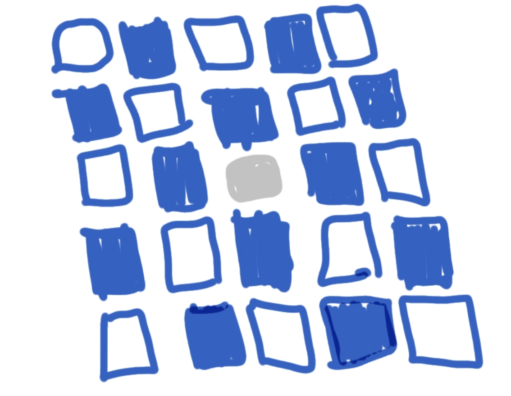

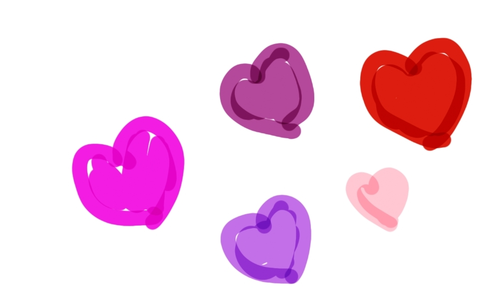

***

## BeSquare

Exploring the Canvas coordinate system by drawing squares. The coordinate system looks like this:
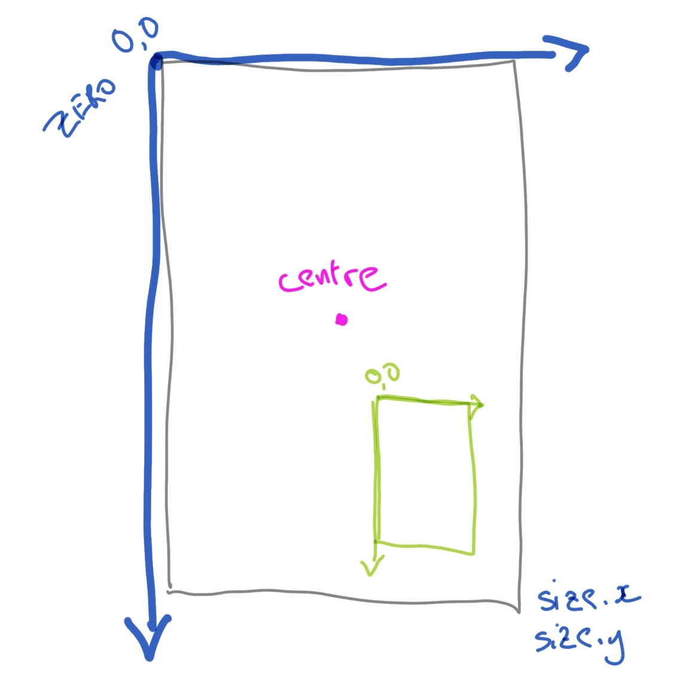

## Dotty

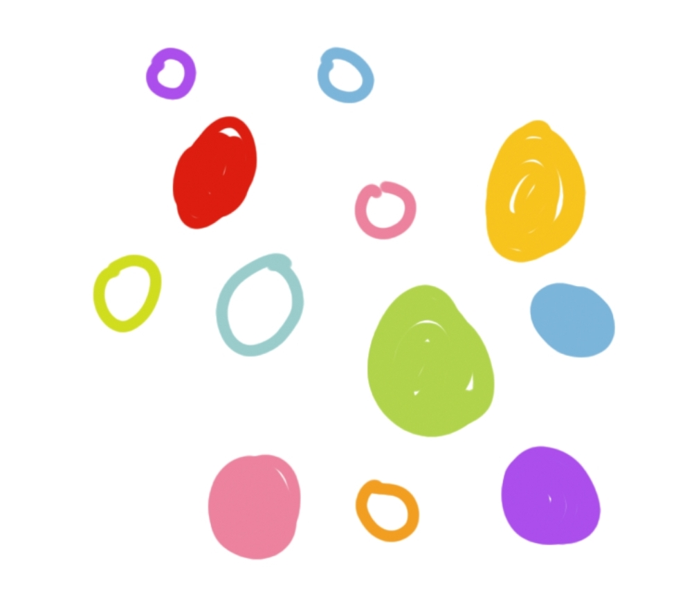

Circles filled and empty. Ellipses and ovals.

## LotsOfLines

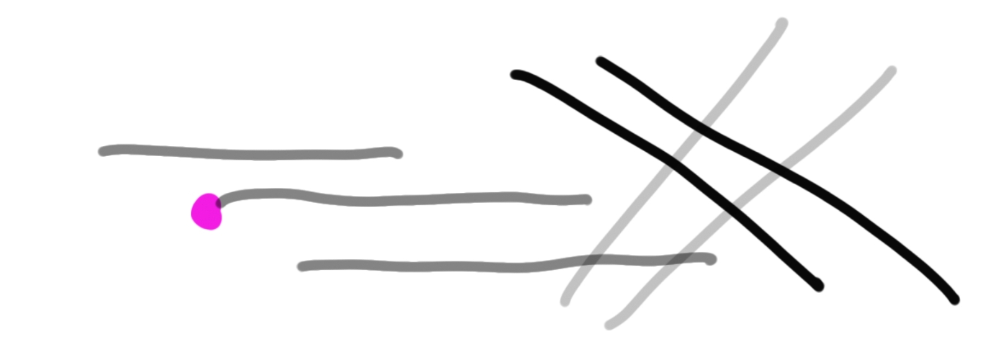

The coordinate system again. A line has two ends and a thickness.

## MyBrush

Gradients in all directions

## SweetPath

Join the dots. Bezier curves. Translations and rotations. Here is a [site](http://blogs.sitepointstatic.com/examples/tech/canvas-curves/bezier-curve.html)
that shows how the `cubicTo` method works. Also some animations.

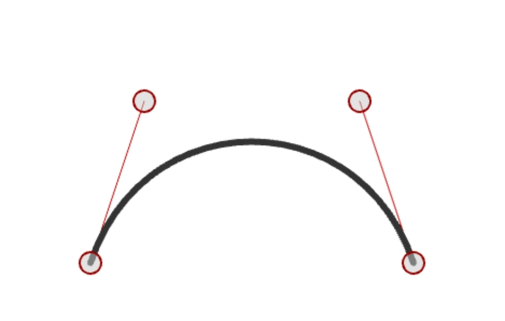

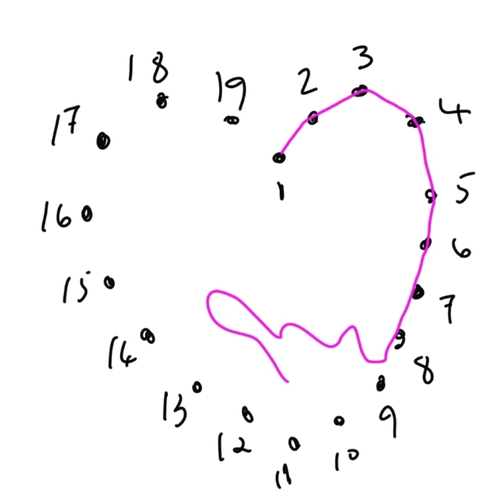

## Sample - mobile and desktop

What's the difference between mobile and desktop.

Desktop has:

- Window
- Toolbar
- Notifications
- Mouse clicks/drags/moves
- Lifecycle is simple

Mobile has:

- Complex lifecycle
- Back button
- Touch gestures
- Android system interactions

The drawing part is almost identical between Desktop and Android.

| Mobile                             | Desktop                                             |
|------------------------------------|-----------------------------------------------------|
| 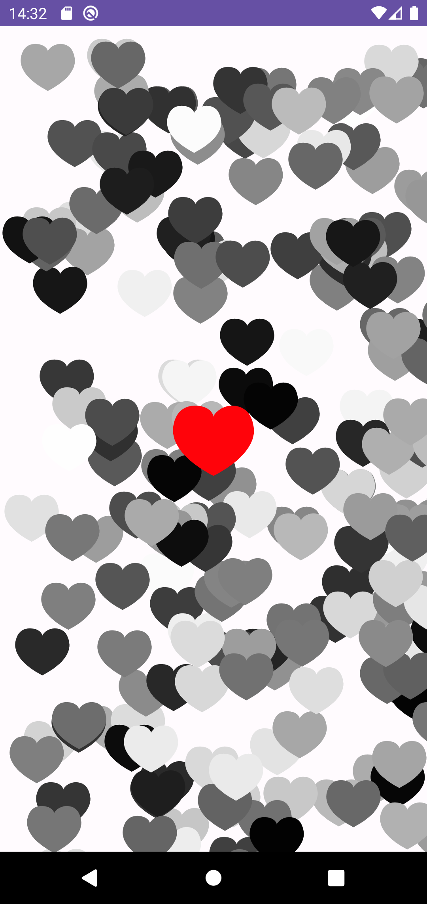   | 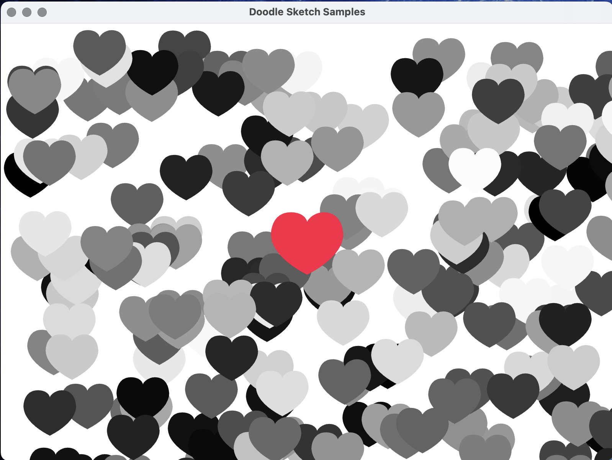  |
| 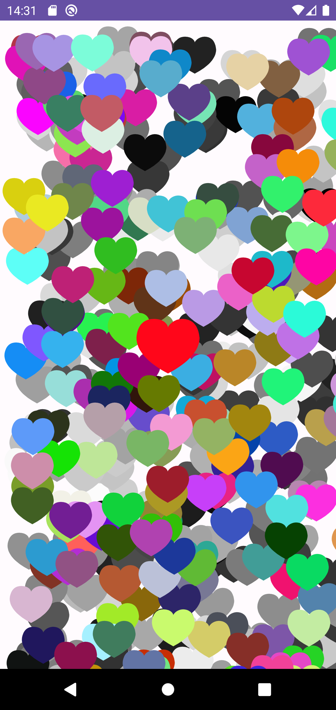 | 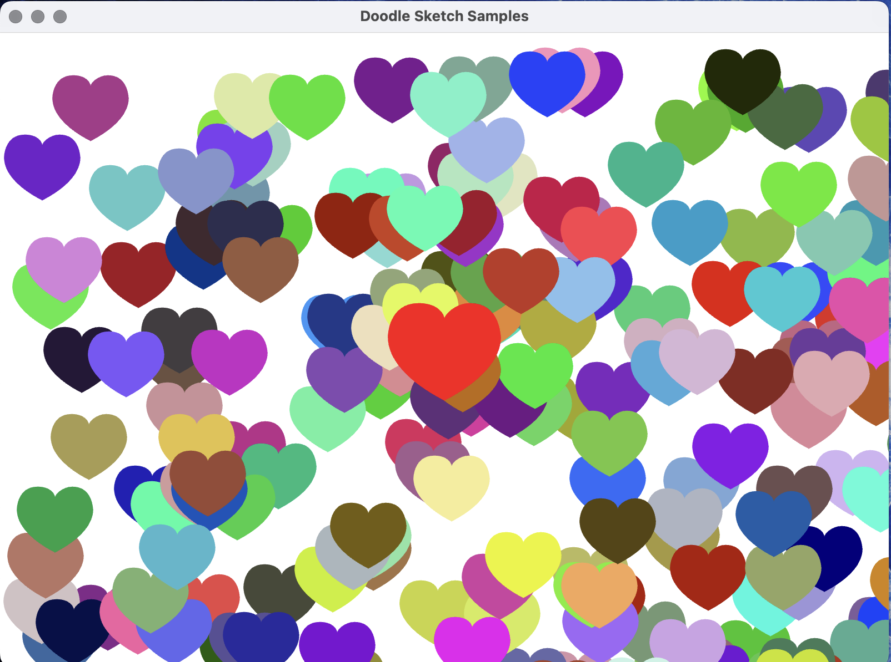 |

## All the things and Choices

Setup some choices and draw from the choices. Drawing libraries typically have an area of code where you can initialise things and than an an area of code or a method which draws repeatedly. In Compose if you want to update what is on the screen then you change the state. The core mechanism that compose has is that the Composer will recompose the `@Composable` functions if the state changes. So in this final example if the `Choices` are modified or the random points change, all the composables will be called again and redraw.

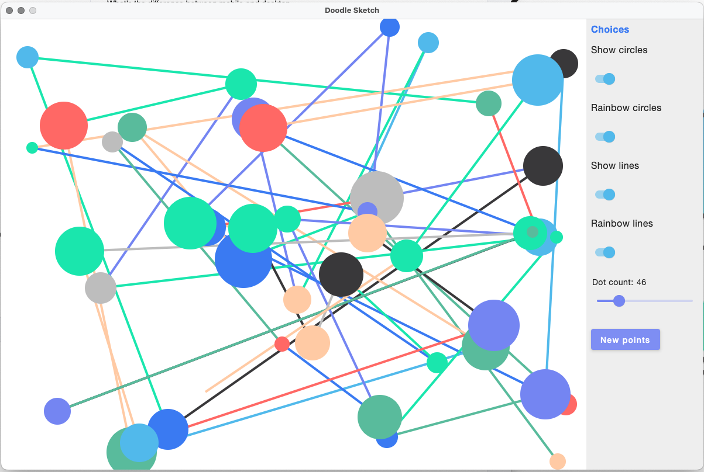